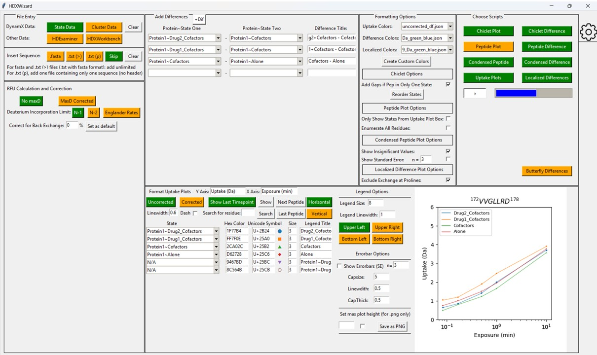

# HDXWizard

HDXWizard is a free, open source software for processing and displaying hydrogen/deuterium exchange mass spectrometry (HDX MS) data. HDXWizard takes DynamX state or cluster data as a .csv or .xlsx file and generates chiclet plots and color peptide plots, as well as uptake plots and localized difference plots that can be exported to PyMOL.

HDXWizard is written completely in python (3.11.3) and uses Tkinter (8.6) for graphical user interface, Numpy (1.24.3) for calculations, MatPlotLib (3.7.2) for plot generation, PyMuPDF (1.23.7) for image processing, Biopython (1.82) for pairwise alignment, PyTorch (2.3.1) for machine learning, and Openpyxl (3.1.2), Pandas (2.0.1), and Xlwings(0.30.12) for reading, writing, and representing excel sheets. Please see the requirements.txt file for up to date version information.

[Cohen Z.A. et al. Poster ASMS 2024](MP%20300_HDXWizard%20A%20Software%20for%20Customizable%20Hydrogen%20Deuterium%20Exchange%20Data%20Visualization.pdf)

HDXWizard was developed at Northeastern University.

Check out [Installation Instructions](Install.md).

Check out our [Frequently Asked Questions](FAQs.md) for more information.

This project includes the use of xlwings, which is licensed under the [BSD 3-Clause License](XLWINGS_LICENSE).

The code in this project is licensed under the [MIT License](LICENSE).
